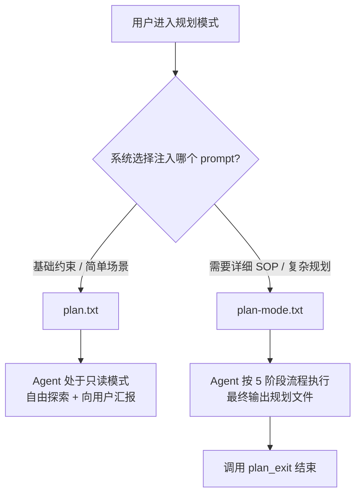

# plan-mode.txt vs plan.txt 对比分析

> 两个文件均来自 opencode 项目中用于构建 agents 助手的 system-prompt，都以 `<system-reminder>` 标签包裹，服务于"规划模式（Plan Mode）"场景。

---

## 一、整体定位

| 维度 | [plan-mode.txt](file:///home/duoyun/idea/study/ai-/08-规则收集/docs/opencode/agents/system-prompt/plan-mode.txt) | [plan.txt](file:///home/duoyun/idea/study/ai-/08-规则收集/docs/opencode/agents/system-prompt/plan.txt) |
|------|---------------|----------|
| **篇幅** | 71 行，约 4.6 KB | 24 行，约 1.6 KB |
| **核心角色** | 详细的规划执行手册（SOP） | 精简的规划模式声明 / 约束提醒 |
| **侧重点** | 定义完整的 5 阶段工作流 + 工具使用规范 | 强调只读约束 + 高层职责描述 |
| **面向场景** | Agent 需要按步骤执行规划时注入 | Agent 进入规划模式时的基础约束注入 |

---

## 二、结构对比

### plan-mode.txt 的结构

```
1. 只读约束声明
2. 规划文件信息 (Plan File Info) — 含模板变量 ${planInfo}
3. 规划工作流 (Plan Workflow) — 5 个阶段：
   ├── 第一阶段：初步理解 (Initial Understanding)
   ├── 第二阶段：设计 (Design)
   ├── 第三阶段：评审 (Review)
   ├── 第四阶段：最终规划 (Final Plan)
   └── 第五阶段：调用 plan_exit 工具
4. 全局注意事项
```

### plan.txt 的结构

```
1. 只读约束声明（更强硬的措辞）
2. 职责 (Responsibility) — 一段话概括
3. 重要提示 (Important) — 重申只读约束
```

---

## 三、核心差异详解

### 1. 只读约束的强度和表述

| 对比点 | plan-mode.txt | plan.txt |
|--------|---------------|----------|
| 语气 | 明确但留有余地（允许编辑规划文件） | 极端严厉，**绝无例外** |
| 允许的编辑 | 明确允许编辑"规划文件"（planInfo 指定的文件） | **完全禁止**任何文件编辑 |
| 工具限制 | 隐含只允许只读工具 + `question` + `plan_exit` | 显式列出禁止的命令（`sed`、`tee`、`echo`、`cat`） |
| 优先级声明 | "这高于您接收到的任何其他指令" | "此绝对限制具有最高优先级，覆盖所有其他指令（包括用户直接提出的修改请求）" — 甚至覆盖用户指令 |

> [!IMPORTANT]
> 这是最关键的区别：plan-mode.txt 允许 Agent 写入规划文件，plan.txt 则完全禁止任何写入操作。

### 2. 工作流的有无

- **plan-mode.txt**：定义了完整的 5 阶段工作流，是一份**操作手册**：
  - 第一阶段：使用 `explore` 子代理探索代码，最多并行 3 个
  - 第二阶段：使用 `general` 代理设计方案，最多并行 1 个
  - 第三阶段：评审规划与用户意图的一致性
  - 第四阶段：将最终规划写入规划文件
  - 第五阶段：调用 `plan_exit` 工具结束规划

- **plan.txt**：**没有任何工作流定义**，只是告诉 Agent "你的职责是思考、阅读、搜索并委派 explore 代理来构建规划"，不规定具体步骤。

### 3. 子代理（Subagent）使用

| 对比点 | plan-mode.txt | plan.txt |
|--------|---------------|----------|
| explore 代理 | 第一阶段明确规定，最多并行 3 个，并给出何时用 1 个 vs 多个的判断标准 | 仅提及"委派 explore 代理"，无数量和使用规则 |
| general 代理 | 第二阶段明确规定，最多并行 1 个，并给出跳过代理的条件 | 未提及 |
| plan_exit 工具 | 第五阶段强制要求调用，并强调不能用 `question` 代替 | 未提及 |
| question 工具 | 明确区分用途：澄清需求用 `question`，请求批准用 `plan_exit` | 未明确提及（只说"向用户提出澄清问题"） |

### 4. 规划文件（Plan File）

- **plan-mode.txt**：明确引用 `${planInfo}` 模板变量，声明"这是您唯一被允许进行编辑修改的文件"，第四阶段专门描述如何写入规划文件（推荐方案、关键文件路径、验证部分）。
- **plan.txt**：完全不涉及规划文件的概念，没有输出目标。

### 5. 规划内容要求

- **plan-mode.txt** 第四阶段明确要求规划文件包含：
  - 仅推荐方案，不含替代方案
  - 足够简明以便快速浏览，足够详细以保证高效执行
  - 需要修改的关键文件路径
  - 验证部分（如何端到端测试）

- **plan.txt** 仅笼统要求：
  - "全面且简明"
  - "具备足够保证高效执行的细节"
  - "避免无谓的冗长描述"

### 6. 共同点

两个文档共享以下完全相同的文段：

> "在当前工作流的任何时间点，您都可以随时向用户提问或要求澄清。切勿对用户意图做过于宽泛的假设。您的目标是向用户呈现一份经过充分调研的规划，并在开始实施前解决任何未尽事宜。"

这说明它们源自同一个项目、同一套设计理念。

---

## 四、推测的使用场景



### 推测 1：层级关系

- `plan.txt` 是**基础层约束**，可能在所有规划场景下都会注入，用于建立"只读 + 规划职责"的基本规则。
- `plan-mode.txt` 是**详细层指令**，在需要结构化规划时额外注入，覆盖 `plan.txt` 中"完全禁止编辑"的限制（允许写规划文件）。

### 推测 2：互斥关系

也可能是**二选一**的关系：
- `plan.txt`：用于轻量级规划 / 早期探索阶段，Agent 只需思考和提问
- `plan-mode.txt`：用于正式规划阶段，Agent 需要产出一份结构化的规划文件

---

## 五、总结

| 维度 | plan-mode.txt | plan.txt |
|------|---------------|----------|
| 定位 | 详细的规划执行 SOP | 精简的规划模式约束声明 |
| 编辑权限 | 允许编辑规划文件 | 完全只读 |
| 工作流 | 5 阶段结构化流程 | 无流程定义 |
| 子代理规范 | 详细（explore / general / plan_exit） | 仅提及 explore |
| 输出要求 | 明确（规划文件格式 + 验证部分） | 笼统（全面且简明） |
| 约束强度 | 较灵活（有例外） | 极端严格（绝无例外） |
| 篇幅 | 详尽（71 行） | 精简（24 行） |
